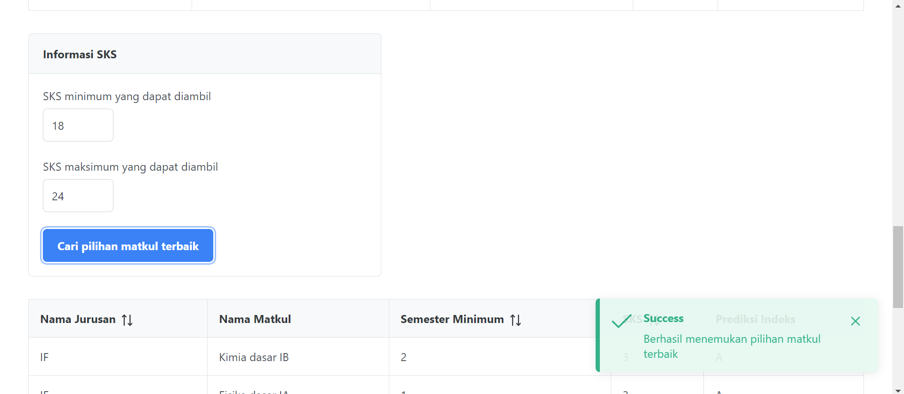

## Deskripsi Program

Program ini merupakan aplikasi berbasis web yang digunakan untuk menemukan pilihan mata kuliah yang dapat menghasilkan IP maksimal. Terdapat tiga data utama yang disimpan pada program ini, yaitu:

- Fakultas, yang memiliki atribut:
  - Nama fakultas
- Jurusan, yang memiliki atribut:
  - Nama jurusan
  - Nama fakultas dari jurusan tersebut
- Matkul, yang memiliki atribut:
  - Nama matkul
  - Nama jurusan dari matkul tersebut
  - Minimum semester pengambilan
  - Jumlah SKS matkul
  - Prediksi indeks matkul

Dengan ketiga data tersebut, pengguna dapat menemukan pilihan mata kuliah yang dapat menghasilkan IP maksimal dengan menginput fakultas pengguna, semester pengguna saat ini, SKS minimal yang dapat diambil, serta SKS maksimal yang dapat diambil. Program akan menampilkan pilihan mata kuliah yang disarankan, IP yang dihasilkan, serta total SKS dari matkul-matkul tersebut. Selain itu, pengguna dapat menambah atau menghapus data entitas Fakultas, Jurusan, maupun Matkul.

## Teknologi yang Digunakan

- NEXT.JS sebagai framework untuk bagian frontend aplikasi
- PRIMEREACT sebagai UI component library
- Docker untuk container aplikasi

## Cara menjalankan aplikasi

- Jalankan server backend [Backend repository](https://github.com/haziqam/course-scheduler-backend)
- Clone repository ini dengan memasukkan command berikut di terminal atau download .zip repository ini. Kemudian, masuk ke directory projek ini.
  ```
  git clone https://github.com/haziqam/course-scheduler-frontend.git
  cd  course-scheduler-frontend
  ```
- Buka aplikasi docker desktop, kemudian jalankan command berikut di terminal
  ```
  docker compose up -d
  ```
- Secara default, program akan dihost pada http://localhost:3000. Buka link berikut untuk menggunakan aplikasi, atau cek URL yang ditampilkan pada terminal setelah menjalankan command sebelumnya.

## Cara menggunakan aplikasi

- Berikut adalah homepage aplikasi ketika membuka URL aplikasi
  

- Apabila data ketiga entitas (Fakultas, Jurusan, Matkul) sudah ada, klik tombol `Get Started` pada laman atau link `Best Matkul Finder` pada navbar untuk mencari pilihan matkul terbaik.
- Berikut adalah cara untuk menampilkan matkul terbaik
  - Berikut adalah tampilan laman `Best Matkul Finder`. Masukkan nama fakultas dan semester Anda saat ini.
    
  - Klik tombol `Lihat matkul yang tersedia` untuk menampilkan matkul yang tersedia berdasarkan fakultas dan semester yang telah diinput
    
    
  - Masukkan SKS minimum dan maksimum yang dapat diambil pada semester ini, lalu klik tombol `Cari pilihan matkul terbaik`
    
  - Berikut adalah tampilan matkul terbaik, IP serta SKS yang diambil
    
    
  - Contoh testcase lain:
    
    
- Berikut adalah cara untuk memodifikasi data

  - Data fakultas
    - Klik link `Fakultas` pada navbar. Berikut adalah tampilan laman `Fakultas`
      
    - Klik tombol `New` untuk menambahkan fakultas, masukkan nama fakultas. Pastikan nama fakultas unik.
      
    - Klik tombol `Save`. Fakultas baru akan ditambahkan pada tabel.
      
    - Anda juga dapat menambahkan beberapa fakultas sekaligus dengan mengupload file JSON dengan format seperti ini. Pastikan nama fakultas unik. Klik tombol `Batch upload` dan upload file JSON yang telah dibuat.
      ```json
      [{ "namaFakultas": "FISIP" }, { "namaFakultas": "FEB" }]
      ```
    - Untuk menghapus data fakultas, klik tombol trash pada salah satu fakultas yang akan dihapus, lalu klik tombol `Yes`.
      
      
    - NOTE: penghapusan bersifat cascading, artinya apabila suatu fakultas dihapus, maka seluruh jurusan pada fakultas tersebut dan matkul jurusan pada fakultas tersebut juga akan terhapus
  - Data jurusan

    - Klik link `Jurusan` pada navbar. Berikut adalah tampilan laman `Jurusan`
      

      - Klik tombol `New` untuk menambahkan jurusan, masukkan nama jurusan dan nama fakultas. Pastikan nama jurusan unik.
        
      - Klik tombol `Save`. Jurusan baru akan ditambahkan pada tabel.
        
      - Anda juga dapat menambahkan beberapa jurusan sekaligus dengan mengupload file JSON dengan format seperti ini. Pastikan nama jurusan unik. Klik tombol `Batch upload` dan upload file JSON yang telah dibuat.

        ```json
        [
          {
            "namaJurusan": "Kuliah santuy",
            "namaFakultas": "FTTM"
          },
          {
            "namaJurusan": "No chaos",
            "namaFakultas": "FSRD"
          }
        ]
        ```

      - Untuk menghapus data jurusan, klik tombol trash pada salah satu jurusan yang akan dihapus, lalu klik tombol `Yes`
        
        

  - Data matkul

    - Klik link `Matkul` pada navbar. Berikut adalah tampilan laman `Matkul`
      

    - Klik tombol `New` untuk menambahkan matkul, masukkan nama jurusan, nama matkul, semester minimum pengambilan, SKS, serta prediksi indeks. Pastikan nama matkul unik terhadap nama jurusan.
      
    - Klik tombol `Save`. matkul baru akan ditambahkan pada tabel.
      
    - Anda juga dapat menambahkan beberapa matkul sekaligus dengan mengupload file JSON dengan format seperti ini. Pastikan nama jurusan unik. Klik tombol `Batch upload` dan upload file JSON yang telah dibuat.

      ```json
      [
        {
          "namaMatkul": "Testttt",
          "sks": 2,
          "namaJurusan": "AR",
          "minSemester": 2,
          "prediksiIndeks": "C"
        },
        {
          "namaMatkul": "apa",
          "sks": 4,
          "namaJurusan": "EP",
          "minSemester": 2,
          "prediksiIndeks": "BC"
        }
      ]
      ```

    - Untuk menghapus data matkul, klik tombol trash pada salah satu matkul yang akan dihapus, lalu klik tombol `Yes`
      
      
